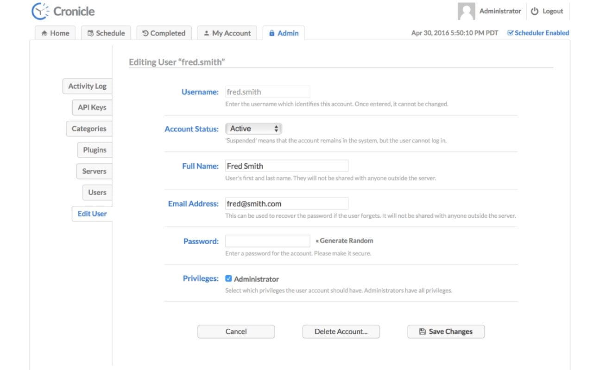

# Cronicle CI/CD pipeline

Deploy Cronicle server with CI/CD on Elestio

 
 

# Once deployed ...

You can open Cronicle ADMIN UI here:

    URL: https://[CI_CD_DOMAIN]
    email: admin
    password: [ADMIN_PASSWORD]
